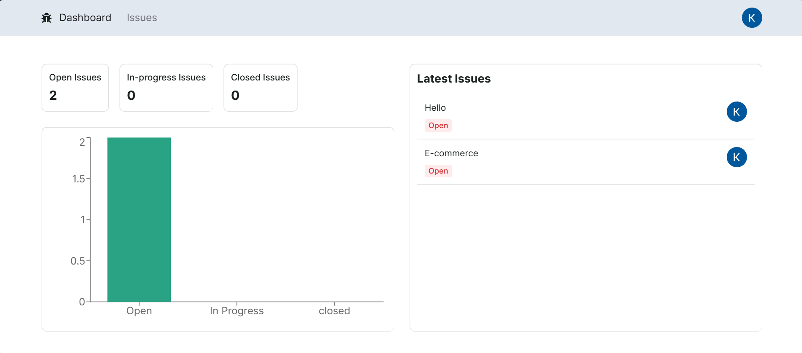
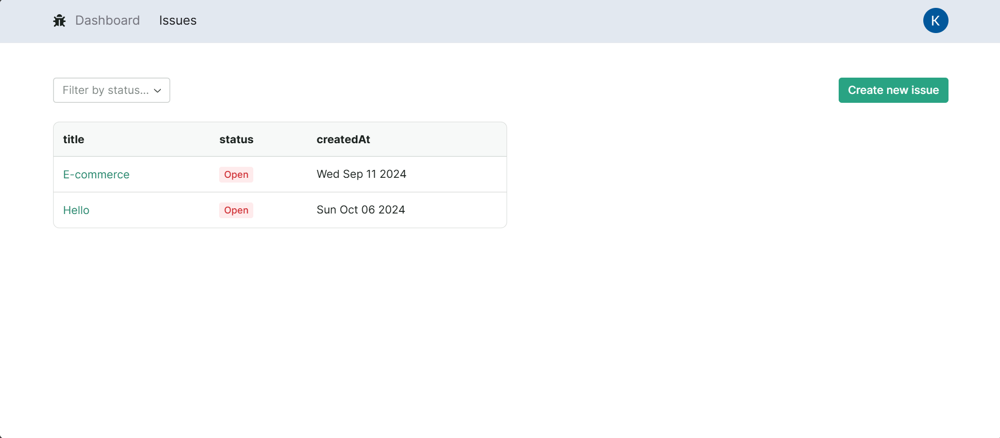
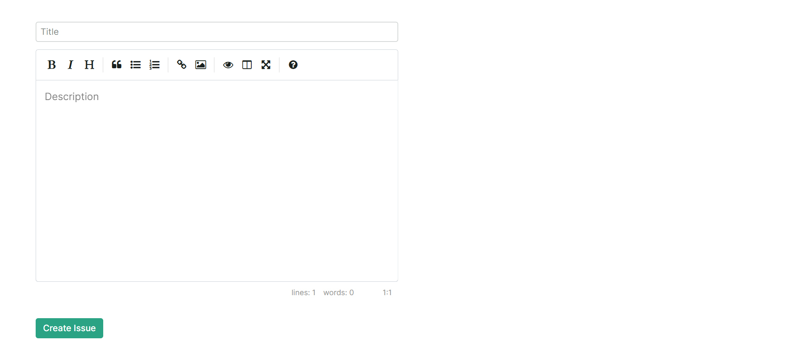
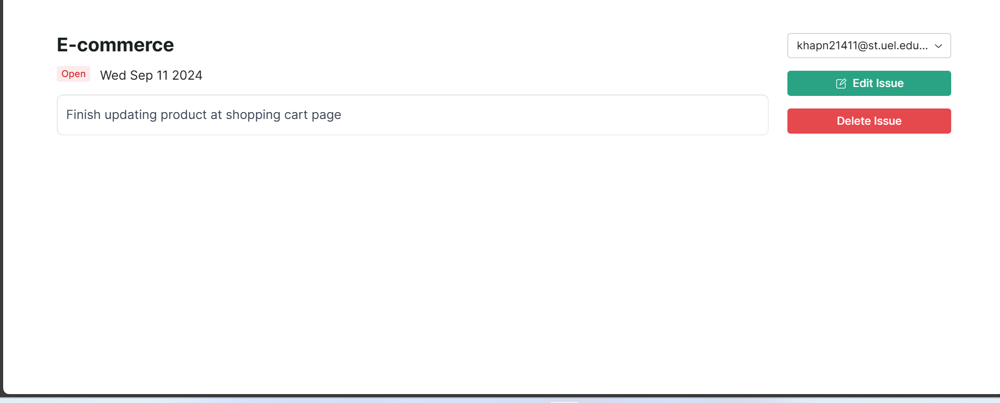

# Issue Tracker
Welcome to my personal Issue Tracker - a web application for tracking issues for employees.

## Features
- Providing internal tracking issues capality.
- CRUD with issues, assign issues to users.
- Client-side validation, OpenAuth user authentication and access control.
- Dashboard with charts implemented.

## Getting Started
First, clone the repository:

```
git clone https://github.com/kharpham/Issue-tracker.git
```

Then run the server
```bash
npm run dev
```

Open [http://localhost:3000](http://localhost:3000) with your browser to see the result.

## Screenshots


*Dashboard page*


*Issues page*


*Create issue page*


*Edit issue page*